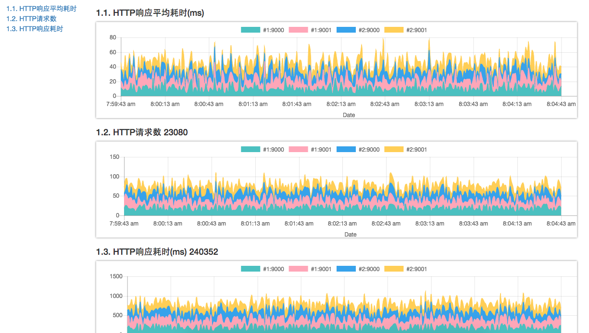

[](https://david-dm.org/plantain-00/monitor-a-list-from-redis)
[](https://david-dm.org/plantain-00/monitor-a-list-from-redis#info=devDependencies)
[](https://travis-ci.org/plantain-00/monitor-a-list-from-redis)

# monitor-a-list-from-redis

A simple tool to watch some realtime data from a redis source

## example



## collect data

#### 1. for each node, count in current process

eg, you have `httpRequestsCount` and `wsMessagesReceivedCount` in every node.

#### 2. for each node, set a timer, every 1 second, push all the counts to a temperary redis list

eg, the data format looks like:
```json
{
    "host": "#1",
    "port": 9000,
    "counts": [1, 2]
}
```

#### 3. set a global timer, every 1 second, get all the data from the temperary list, and push them(serialized to a JSON string) to a final list

eg, the data format looks like:
```json
{
    "time": 1462577597380,
    "nodes": [
        {
            "host": "#1",
            "port": 9000,
            "counts": [1, 2]
        },
        {
            "host": "#1",
            "port": 9001,
            "counts": [3, 4]
        },
        {
            "host": "#2",
            "port": 9000,
            "counts": [5, 6]
        },
        {
            "host": "#2",
            "port": 9001,
            "counts": [7, 8]
        }
    ]
}
```

keep the final list's length <= 300 after that, it just keep the data of recent 5 minutes.

the temperary list should be cleared after that. 
